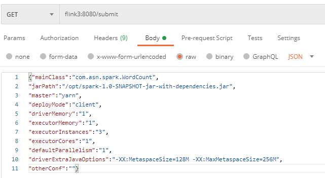

###postman提交spark应用到集群

`{"mainClass":"com.asn.spark.WordCount",
 "jarPath":"/opt/spark-1.0-SNAPSHOT-jar-with-dependencies.jar",
 "master":"yarn",
 "deployMode":"client",
 "driverMemory":"1",
 "executorMemory":"1",
 "executorInstances":"3",
 "executorCores":"1",
 "defaultParallelism":"1",
 "driverExtraJavaOptions":"-XX:MetaspaceSize=128M -XX:MaxMetaspaceSize=256M",
 "otherConf":""}`